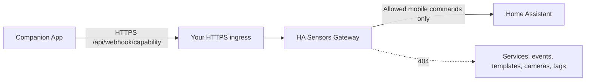

<div align="center">

# Home Assistant Sensors Gateway

**Send Companion App sensor and location updates home without publishing Home Assistant.**

[](https://github.com/abhi1693/ha-sensors-gateway/actions/workflows/ci.yml)
[](https://github.com/abhi1693/ha-sensors-gateway/releases/latest)
[](https://github.com/abhi1693/ha-sensors-gateway/pkgs/container/ha-sensors-gateway)
[](LICENSE)

</div>

Home Assistant Sensors Gateway is a small, least-privilege reverse gateway for
the native Home Assistant Companion App webhook protocol. It forwards sensor,
location, and configuration requests while making control-capable or unsafe
registration commands indistinguishable from a missing endpoint.

It is designed for people who want remote phone telemetry through Cloudflare
Tunnel, Tailscale Funnel, a conventional reverse proxy, or another HTTPS ingress
without exposing the Home Assistant frontend, REST API, WebSocket API, login
routes, or service calls.

## Why this exists

A normal Home Assistant external URL exposes the complete application surface.
This gateway publishes only one capability-scoped path and understands enough of
the mobile protocol to reject commands that could operate the home.



The gateway is intentionally **not** a remote dashboard, notification relay,
VPN, authentication proxy, or general Home Assistant API gateway.

## Security model

Allowed native commands:

| Command | Purpose |
| --- | --- |
| `update_sensor_states` | Send every enabled sensor state and its attributes. |
| `update_location` | Update the mobile device tracker. |
| `register_sensor` | Register newly enabled Companion App sensors. |
| `get_config` | Read the mobile integration configuration required by the app. |
| `get_zones` | Read zones used by mobile location tracking. |

Control commands—including `call_service`, `fire_event`, `render_template`,
`conversation_process`, `stream_camera`, and `scan_tag`—receive `404` and are
never forwarded. `update_registration` is also rejected because Home Assistant
allows it to replace the mobile push URL and token, which could redirect future
notification contents to another endpoint. Perform registration and push-token
changes through a trusted direct connection to Home Assistant.

Additional controls include:

- constant-time capability comparison;
- strict 64-character webhook ID and path validation;
- JSON-only requests and duplicate-key rejection;
- configurable request/response limits and per-capability rate limiting;
- a fixed operator-defined upstream, preventing request-driven SSRF;
- bounded timeouts and secret-free structured logs;
- a non-root, multi-architecture container with no runtime dependencies;
- pinned base image, SBOM, provenance, and GitHub artifact attestation.

> [!IMPORTANT]
> A mobile webhook ID is a bearer credential. Store the capability map in a
> secret, expose the gateway only through HTTPS, and never place real IDs in
> logs, issues, screenshots, or source control.

> [!NOTE]
> Encrypted Companion App webhook envelopes are rejected. The gateway must read
> the command type to enforce its safety allowlist; forwarding opaque encrypted
> commands would also permit control operations.

## Quick start

### 1. Create the capability map

Copy `examples/webhooks.example.json` to `webhooks.json` and replace the example
key with the `webhook_id` from the device's Home Assistant `mobile_app`
registration. Add one entry per device:

```json
{
  "64-character-lowercase-hex-webhook-id": {
    "device": "descriptive-alias"
  }
}
```

The alias is used only in logs. It must contain lowercase letters, numbers, or
dashes and be at most 32 characters.

### 2. Run the container

```sh
docker run --rm \
  --name ha-sensors-gateway \
  --read-only \
  --cap-drop=ALL \
  --security-opt=no-new-privileges \
  -p 127.0.0.1:8080:8080 \
  -e UPSTREAM_URL=http://home-assistant:8123 \
  -v "$PWD/webhooks.json:/run/secrets/webhooks.json:ro" \
  ghcr.io/abhi1693/ha-sensors-gateway:0.1.0
```

Alternatively, copy `examples/compose.yaml` and start it with `docker compose
up -d` after connecting its external network to Home Assistant.

### 3. Publish only the webhook path

Route only this prefix to the gateway:

```text
/api/webhook/
```

Do not route `/`, `/api/`, `/auth/`, `/lovelace/`, `/config/`, or Home
Assistant's WebSocket endpoint. The internal health check is `GET /healthz`; it
does not need public ingress.

### 4. Configure the Companion App

Set the app's external Home Assistant URL to the HTTPS origin in front of the
gateway. Keep the normal internal URL for on-network dashboard access. The
gateway appends no device ID itself—the Companion App constructs its native
`/api/webhook/<id>` request.

## Configuration

| Variable | Default | Description |
| --- | --- | --- |
| `UPSTREAM_URL` | Required | Internal Home Assistant origin, such as `http://home-assistant:8123`. |
| `PORT` | `8080` | Gateway listen port. |
| `WEBHOOK_CONFIG` | `/run/secrets/webhooks.json` | Mounted capability map. |
| `RATE_LIMIT_PER_MINUTE` | `180` | Maximum accepted requests per webhook capability. |
| `MAX_REQUEST_BYTES` | `2097152` | Maximum complete sensor batch size; upper bound is 16 MiB. |
| `MAX_RESPONSE_BYTES` | `1048576` | Maximum Home Assistant response size; upper bound is 16 MiB. |
| `MAX_CONCURRENT_REQUESTS` | `64` | Maximum active client connections; upper bound is 1024. |
| `TIMEOUT_SECONDS` | `15` | Absolute request header/body deadline and upstream socket timeout; upper bound is 120 seconds. |

Connections above `MAX_CONCURRENT_REQUESTS` are closed without being assigned a
worker. The process fails closed at startup when configuration is missing or
invalid.

## Reverse-proxy requirements

- Terminate TLS with a publicly trusted certificate.
- Preserve the exact request path and body.
- Permit `POST` to `/api/webhook/<id>`.
- Set a request-body limit at least as large as `MAX_REQUEST_BYTES`.
- Enforce edge connection limits and an absolute header/body deadline no longer
  than the gateway's `TIMEOUT_SECONDS`.
- Do not log full webhook paths at the proxy or tunnel layer.
- Restrict the gateway's network egress to Home Assistant and DNS where your
  platform supports network policy.

Cloudflare Tunnel users can publish a path-specific ingress rule. Be aware that
any provider terminating TLS can observe the webhook capability in the URL.

## Development

The runtime uses only the Python standard library.

```sh
python -m pip install ruff==0.15.22
ruff check .
ruff format --check .
PYTHONPATH=src python -m unittest discover -s tests -v
docker build -t ha-sensors-gateway:test .
```

CI tests Python 3.12, 3.13, and 3.14. Tagged releases publish attested
`linux/amd64` and `linux/arm64` images to GHCR.

## Operational guidance

- Keep Home Assistant private and expose only the gateway path.
- Rotate a webhook by re-registering the mobile integration, then replace its
  capability-map entry.
- Back up no gateway state; the service is stateless.
- Treat repeated `rejected` events as a reason to review app configuration and
  edge access logs without recording request bodies or full paths.
- Use one replica unless your ingress and rate-limit requirements justify more;
  rate-limit state is intentionally local to each process.

## License

MIT. See [LICENSE](LICENSE).
